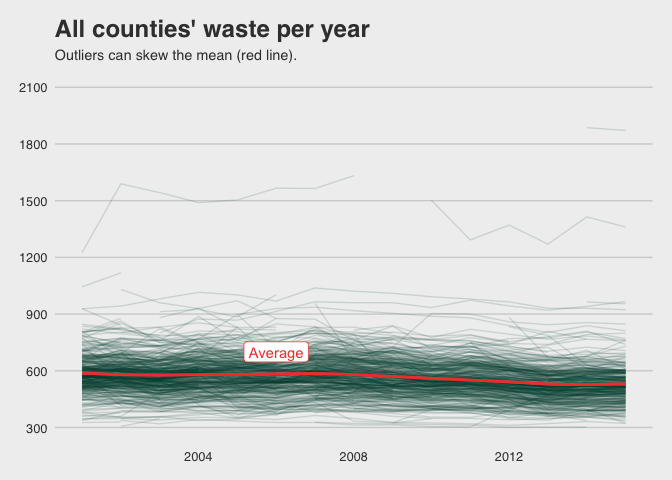

Line chart
================

Data import and preperation.
----------------------------

``` r
library(tidyverse)
library(cbsodataR)
library(ggthemes)

# Access CBS table list
tables <- get_table_list()
# Retrieve data set with identifier: "Huishoudelijk afval per gemeente per inwoner"
df <- get_data('83452NED')
# Convert to numeric value
df$HoeveelheidHuishoudelijkAfval_1 <- as.numeric(df$HoeveelheidHuishoudelijkAfval_1) 
# rename long variable
df <- rename(df, Waste = HoeveelheidHuishoudelijkAfval_1)
# Total domestic waste
totalWaste <- df %>%
  group_by(Perioden) %>%
  summarise(Waste = sum(Waste, na.rm = TRUE))
# Convert Perioden variable
totalWaste$Perioden <- as.numeric(as.character(totalWaste$Perioden))
```

Taking a closer look at the NA values
-------------------------------------

When looking at the `totalWaste` data frame you see clearly a downwards trend. Because There are quite a lot of NA values, it's a good habit to check wether the number of NA values causes this downwards trend.

``` r
# Counting NA's for each Period
isNA <- df %>%
  group_by(Perioden) %>%
  summarise(isNA = sum(is.na(Waste)))
# Creating a data frame with the NA's
merged <- merge(totalWaste, isNA)
```

Time for plotting
-----------------

Now, the difference between the growing number of NA's per year isn't that big as the decline of domestic waste. When taking the NA values in to account we can conclude there's still a big difference between the years 2001-2015. Finally, we can proceed with plotting the line chart.

``` r
# Plotting line chart
merged %>%
  ggplot(aes(x = Perioden, y = Waste, group = 1)) +
  geom_point() +
  geom_line() +
  scale_y_continuous(limits = c(200000,600000)) +
  scale_x_continuous(breaks = seq(2001,2015,2)) +
  labs(title = "Kilo's huishoudelijk afval in Nederland\ndaalt flink") +
  theme_fivethirtyeight() +
  theme(panel.grid = element_line(linetype = "dashed"))
```


