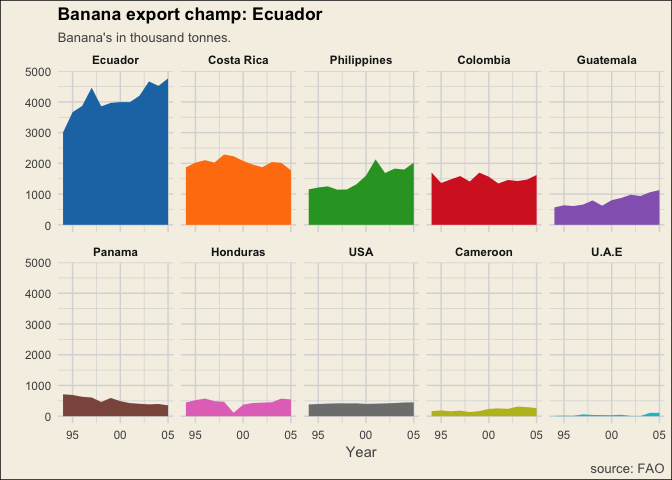

Redesign of a truly Bananas chart
================
2018-01-08


On Twitter I stumbled upon this horrendous 3D bar chart. Looking at the data used it might have been made in 2005. Data visualisation as a skill was yet to be defined. Boy we have come a long way but this was even at the time truly bananas.

Normally I describe in detail about what can be improved. However, this time I trust my audience to recognise the many pitfalls. Watch it, [PhillipDRiggs](https://twitter.com/PhilipDRiggs/status/949429633119748096) warns us in his tweet for "post-traumatic viz syndrome".

Aquire
------

I used data from the Food and Agriculture Organization. They have an awesome data base, [FAOSTAT](http://www.fao.org/faostat/en/#data/TP), where you can create and download your own dataset with ease. You can find and download the dataset I used in this folder as well.

Note: I removed `Belgium-Luxembourg` because there wasn't sufficient data in the FAOSTAT data base.

``` r
library(tidyverse)
library(ggthemes)
library(ggrepel)

# Import data (note that Belgium-Luxembourg is removed for this redesign because of insufficient data from FAO source)
df <- read_csv("/Users/Thomas/colourful-facts/projects/Redesign-of-worst-chart-ever/FAOSTAT_data_1-7-2018.csv")
```

Transform
---------

Prepare data frame for visualisation.

``` r
# Create workable dataframe
df <- df %>%
  mutate(Tonnes_x1000 = Value / 1000, # Smaller number, now in 1000 tonnes
         Year = as.Date(paste(Year, 1, 1, sep = "-")), # Convert to class date
         Country = gsub("United States of America", "USA", Country), # Sorten long `Country` names
         Country = gsub("United Arab Emirates", "U.A.E", Country)) %>%
  group_by(Country) %>%
  mutate(mean = mean(Tonnes_x1000)) %>% # Calculate mean for sorting puposes in visualisation later on
  select(Country, Year, Tonnes_x1000, mean) # Keep only useful columns

# Create order variable, sorting `Country` from greatest to lowest mean
order <- df %>%
  arrange(desc(mean)) %>%
  pull(Country) %>%
  unique()

# Convert Country class to factor with the right order
df$Country <- factor(df$Country, levels = order)
```

Visualisation
-------------

``` r
# Create small multiple line plots with `facet_wrap`.
df %>%
  ggplot(aes(x = Year, y = Tonnes_x1000, colour = Country)) +
  geom_line(size = 0.8) +
  scale_colour_tableau() +
  scale_x_date(date_labels = "%y") +
  facet_wrap( ~ Country, ncol = 5) +
  theme_minimal() +
  theme(legend.position = 0,
        plot.caption = element_text(colour = "#525252"),
        plot.background = element_rect(fill = "#F5F0E5"),
        plot.title = element_text(face = "bold"),
        strip.text = element_text(face = "bold"),
        axis.title.x = element_text(colour = "#525252"),
        plot.subtitle = element_text(colour = "#525252"),
        panel.grid.major = element_line(colour = "#D9D9D9"),
        panel.grid.minor = element_line(colour = "#D9D9D9")) +
  labs(title = "Banana export champ: Ecuador",
       subtitle = "Banana's in thousand tonnes.",
       caption = "source: FAO",
       x = "Year",
       y = "") 
```



``` r
?theme
```
