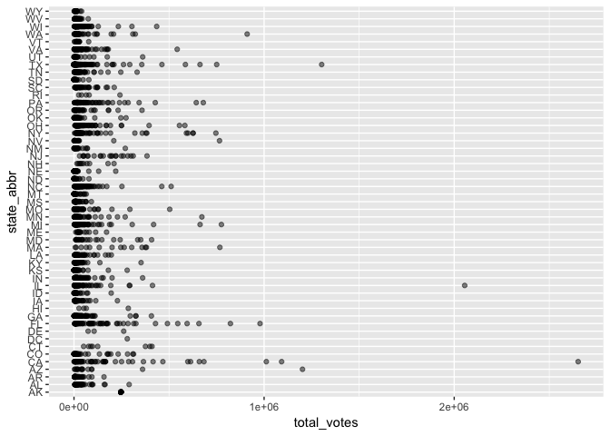
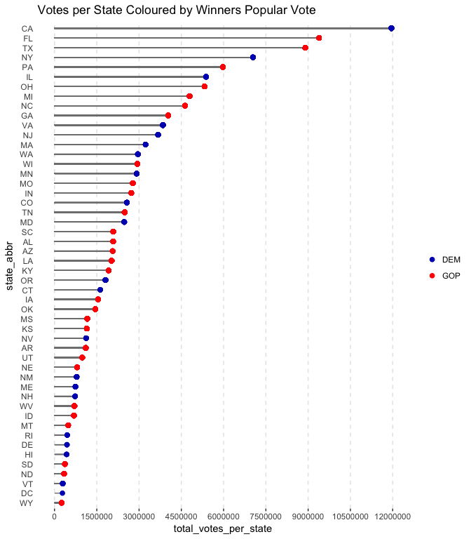

Trump should ignore the Mercator map when showing election results
================

In this file the code that generated the [lollipop chart](https://cdn-images-1.medium.com/max/2000/1*-IqBA8Rk3dfO4Cn7_Pv0sw.png) in the article [Trump should ignore the Mercator map when showing election results](https://medium.com/tdebeus/trump-should-ignore-the-mercator-map-when-showing-election-results-52ad2d33b740) on [Colourful Facts](https://medium.com/tdebeus).

When Trump invited some reporters to talk about his 100 days in office, he handed out an election map with the results of 2016. According to Reuters accompanied with the words:

> Here, you can take that, that’s the final map of the numbers, It’s pretty good, right? The red is obviously us.

The visualisation deviates from the end result in the portfolio, this is because I finalise the visuals in [Sketch](https://www.sketchapp.com/).

First thing first: loading the used R packages.

``` r
library(tidyverse)
```

Data preparation
----------------

``` r
df <- read.csv("/Users/Thomas/Work/Projects/Data/Projects/US-county-election-results/2016_US_County_Level_Presidential_Results.csv")

# Filtering Los Angeles County.
laCounty <- filter(df, county_name == "Los Angeles County")

# Total GOP votes per northen States in the North East.
northDakota <- 216133   
Montana <- 274120   
Idaho <- 407199 
Wyoming <- 174248   
southDakota <- 227701   
Nebrasca <- 485819  

Kansas <- 656009    
Oklahoma <- 947934  

# In these six states 1785220 people voted for Trump.   
southDakota + northDakota + Wyoming + Montana + Idaho + Nebrasca
```

Little exploratory visual
-------------------------

``` r
# Total votes plot per state
ggplot(df, aes(x = total_votes, y = state_abbr)) +
  geom_point(alpha = 0.5)
```



Further data preparation
------------------------

``` r
# Data frame without Alaska and with total votes per state.
df2 <- df %>%
  group_by(state_abbr) %>%
  mutate(total_votes_per_state = sum(total_votes)) %>%
  select(county_name, 
         state_abbr, 
         c(votes_dem:total_votes), 
         total_votes_per_state, 
         c(per_dem:combined_fips)) %>%  
  filter(!state_abbr == "AK")

# Data frame with new varibles added. GOP and DEM per state votes and winner in state.
df3 <- df2 %>%
  group_by(state_abbr) %>%
  mutate(votes_dem_state = sum(votes_dem),
         votes_gop_state = sum(votes_gop),
         winner = ifelse(votes_dem_state > votes_gop_state, 
                         "DEM", 
                         "GOP")) %>%
  select(c(county_name:total_votes_per_state),
         votes_dem_state,
         votes_gop_state,
         winner,
         c(total_votes:combined_fips))

# Colour palette
palette <- c(DEM = "#0006BF",
             GOP = "#FF0000")
```

Visualising the vertical lollipop chart
---------------------------------------

``` r
# Decending lollipop plot coloured by winners popular vote.
ggplot(df3, 
       aes(x = total_votes_per_state, 
                y = state_abbr)) +
  geom_segment(aes(x = 0,
                   y = reorder(state_abbr, total_votes_per_state),
                   xend = total_votes_per_state, 
                   yend = state_abbr),
               colour = "grey50") +
  geom_point(aes(colour = winner),
             size = 2) +
  scale_colour_manual(values = palette) +
  scale_x_continuous(breaks = seq(0, 12000000, 1500000)) +
  theme(panel.background = element_blank(),
        panel.grid = element_line(F),
        panel.grid.major.x = element_line(colour = "grey90",
                                          linetype = "dashed"),
        legend.key = element_blank(),
        axis.ticks.y = element_blank(),
        legend.title = element_blank()) +
  ggtitle("Votes per State Coloured by Winners Popular Vote")
```


